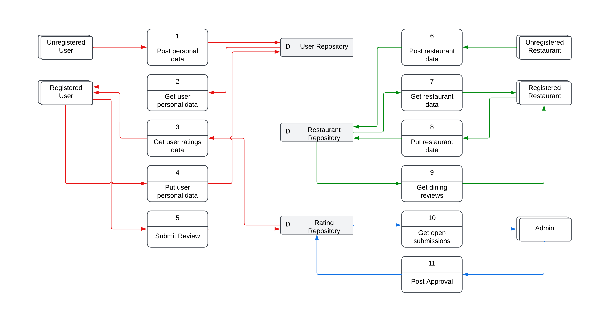

# Dining Review
Projeto de uma API de registro de avaliações de restaurantes. Com esta API é possível realizar a cadastro de usuário e restaurantes, submissão de avaliações e moderação (através do perfil admin).

# Tecnologia
- **Linguagem:** Java com Spring Framework;
- **Banco de Dados:** H2;
- **Documentação da API:** Swagger;
- **Modelagem ERD/DFD:** Lucidchart.

# Desenvolvedor
- Uellerson Carvalho

# Diagrama Entidade-Relacionamento
O ORM mapeará 3 tabelas diferentes:
- **User:** representada na classe ```UserModel.java```;
- **Restaurant:** representada na classe ```RestaurantModel.java```;
- **Ratings:** representada na classe ```RatingModel.java```.


As interfaces ```RestaurantModel.java```, ```UserModel.java``` e ```RatingModel.java``` abstraem as operações de consulta ao banco de dados.


# Diagrama de Fluxo de Dados
Serão utilizados 11 processos (requisições) diferentes:



## Licença

[MIT](https://choosealicense.com/licenses/mit/)
